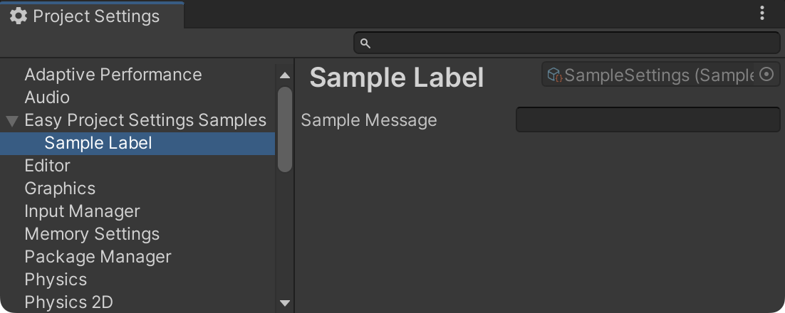

# Easy Project Settings
[](https://openupm.com/packages/com.gilzoide.easy-project-settings/)

Easily create custom Project Settings by adding [ProjectSettingsAttribute](Runtime/ProjectSettingsAttribute.cs) to your `ScriptableObject` subclass!

```cs
using UnityEngine;
using Gilzoide.EasyProjectSettings;

[ProjectSettings("Assets/EasyProjectSettingsSamples/SampleSettings",
    SettingsPath = "Project/Easy Project Settings Samples/SampleSettings",
    Label = "Sample Label")]
public class SampleSettings : ScriptableObject
{
    public string SampleMessage;
}
```




## Features
- Simple to use: just add [ProjectSettingsAttribute](Runtime/ProjectSettingsAttribute.cs) to your `ScriptableObject` subclass and it will automatically appear at the Project Settings window
- Project settings can be easily loaded in script code by calling `ProjectSettings.Load<T>()`
  + Any settings can be loaded by code in the Unity editor, independent of the asset path
  + Settings can be loaded by code in built players if asset paths are relative to a `Resources` folder
- Supports any asset paths, including paths relative to the `ProjectSettings` folder
- Supports your custom editors, no extra code required
- Supports both Project and User [settings scopes](https://docs.unity3d.com/ScriptReference/SettingsScope.html)


## How to install
This package is available on the [openupm registry](https://openupm.com/)
and can be installed using the [openupm-cli](https://github.com/openupm/openupm-cli):

```
openupm add com.gilzoide.easy-project-settings
```

Otherwise, you can install directly using the [Unity Package Manager](https://docs.unity3d.com/Manual/upm-ui-giturl.html)
with the following URL:

```
https://github.com/gilzoide/unity-easy-project-settings.git#1.0.0
```


## How to use
When `AssetPath` is relative to the `Assets` folder, it can be referenced anywhere in project,
just like any other `ScriptableObject`, and loaded using `ProjectSettings.Load` in editor code.

If you don't plan on loading settings at runtime code outside of the Unity editor, this is
the recommended usage.
```cs
using UnityEngine;
using Gilzoide.EasyProjectSettings;

[ProjectSettings("Assets/EasyProjectSettingsSamples/SampleSettings",
    SettingsPath = "Project/Easy Project Settings Samples/SampleSettings")]
public class SampleSettings : ScriptableObject
{
    public string SampleMessage;
}

public class SampleMonoBehaviour : MonoBehaviour
{
    // set me up in the Inspector
    [SerializeField] private SampleSettings _sampleSettings;

    void Start()
    {
        Debug.Log($"Message from settings = '{_sampleSettings.SampleMessage}'");
    }
}
```


When `AssetPath` is relative to a `Resources` folder inside `Assets` folder, it can be
loaded using `ProjectSettings.Load` both in editor and built players.

If you plan on loading settings at runtime code outside of the Unity editor, this is the
recommended usage.
```cs
using UnityEngine;
using Gilzoide.EasyProjectSettings;

[ProjectSettings("Assets/EasyProjectSettingsSamples/Resources/SampleResourcesSettings",
    SettingsPath = "Project/Easy Project Settings Samples/SampleResourcesSettings")]
public class SampleResourcesSettings : ScriptableObject
{
    public string SampleResourcesMessage;
}

public class SampleMonoBehaviour : MonoBehaviour
{
    void Start()
    {
        SampleResourcesSettings settings = ProjectSettings.Load<SampleResourcesSettings>();
        Debug.Log($"Message from settings = '{settings.SampleResourcesMessage}'");
    }
}
```


When `AssetPath` is not relative to `Assets` folder, the asset is only usable by code
running in editor, loaded using `ProjectSettings.Load`.

This may be useful for defining settings for editor-only tools.
```cs
using UnityEditor;
using UnityEditor.Callbacks;
using UnityEngine;
using Gilzoide.EasyProjectSettings;

[ProjectSettings("ProjectSettings/EasyProjectSettingsSamples/EditorOnlySettings",
    SettingsPath = "Project/Easy Project Settings Samples/EditorOnlySettings")]
public class EditorOnlySettings : ScriptableObject
{
    public string EditorOnlyMessage;
}

public static class SampleEditorOnlyPostProcessBuild
{
    [PostProcessBuild]
    public static void OnPostprocessBuild(BuildTarget target, string pathToBuiltProject)
    {
        EditorOnlySettings settings = ProjectSettings.Load<EditorOnlySettings>();
        Debug.Log($"Built project, message from settings = '{settings.EditorOnlyMessage}'");
    }
}
```